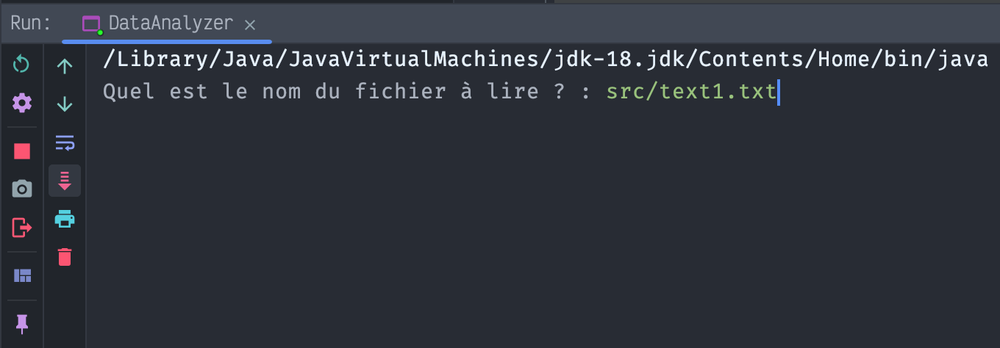
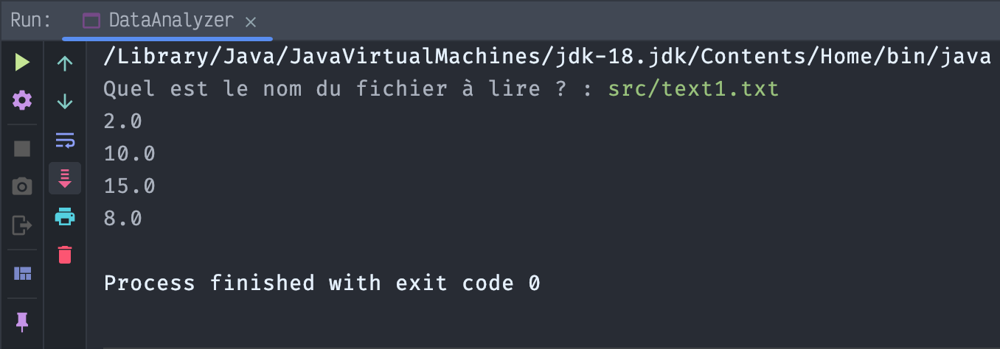

[](https://)
[](https://)
[](https://)


<br/>
<div align="center">
    
    <br/>
    <h1 align="center">Java Exception</h1>
</div>
  <h4 align="center">
    Practical work - Java Core
  </h4>
<br/>


<br/>
<br/>

<!-- TABLE OF CONTENTS -->
<details open="open">
  <summary>Table of Contents</summary>

  <ol>
    <li><a href="#illustration">Illustration</a></li>
    <li><a href="#description">Description</a></li>
    <li><a href="#languages">Languages</a></li>
    <li><a href="#objectives">Objectives</a></li>
    <li><a href="#setup">Setup</a></li>
    <li><a href="#status">Status</a></li>
    <li><a href="#context">Context</a></li>
  </ol>
</details>

<br>
<br>


## ✨ Illustration <a id="illustration"></a>

<br>
<br>



## 🗒 Description <a id="description"></a>
Creation of a small java program that reads a file containing numbers and analyzes the content.
- The program asks the user for a file name.
- The file is supposed to contain (numerical) values. 
- The first line of the file contains the total number of values
- The following lines contain the data.


## 🛠 Languages and tools<a id="languages"></a>
- Java
- Java API - Scanner 👉 https://docs.oracle.com/javase/8/docs/api/index.html?overview-summary.html


## 🎯 Objectives <a id="objectives"></a>
- Practice java Exceptions
- Understand which exceptions can be thrown by a program
- Understand who detects errors (here Scanner constructor)
- Understand which exception can be thrown by the Scanner class
- Understand who interacts with the exceptions (here the main method in DataAnalizer)


## ⚙️ Setup <a id="setup"></a>
How to launch the program :
```bash
  cd ws
```
```bash
javac -d ../class ../src/*.java
```
```bash
java DataAnalizer
```
- Text file to analyse 👉 ```src/text1.txt```

## 📈 Status <a id="status"></a>

Project completed


## 🗓 Context <a id="context"> </a>

I realized this practical work during my bachelor of computer science in the Institute of technology of Vannes
